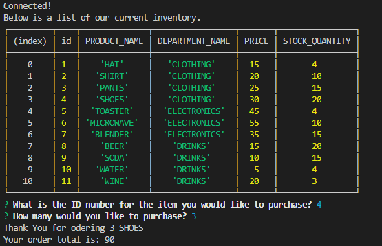
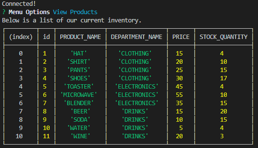
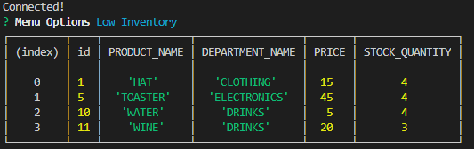
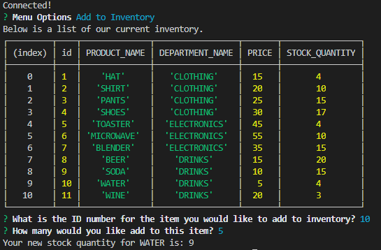
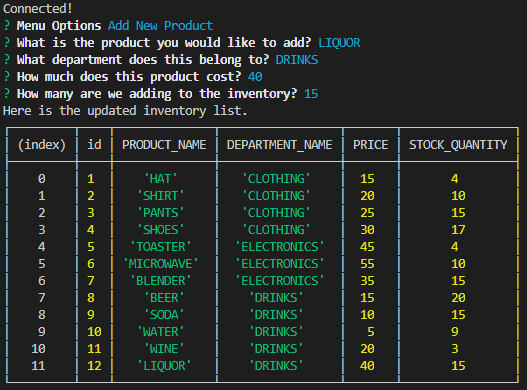

# Bamazon

## Introduction

Bamazon is an Amazon-like store front using node.js and mysql CLI app. 

## Bamazon Setup

1. Clone the repository
2. Run npm install. This will install the following packages...

    * Inquirer

    * Mysql
3. Run command depending on mode you would like to be on. 

    * node bamazonCustomer.js

    * node bamazonManager.js

### What Each command does

1. `bamazonCustomer.js`

    * Prints a table of the products available in the store

    * Asks the customer which product they would like to purchase by ID number provided on the table of products.

    * Asks the customer for the quantity they would like to purchase.

        * If there is not enough stock quantity of the product, it will respond there is not enough stock and to start over.
        * If there is enough stock to fullfull the purchase, it will respond with product name and purchase amount. 
        * If purchase goes through, it will update the database to reflect the new stock quantatity for the product.

-----------------------

2. `bamazonManager.js`

    * Starts with menu of 4 options to select.
        * View Products
        * Low Inventory
        * Add to Inventory
        * Add New Product

    * If the manager selects `View Products` it will provide the table of the current inventory of all products available.

    * If the manager selects `Low Inventory` it will provide a table of the current inventory with stock quantity below 5.

    * If the manager selects `Add to Inventory` it will prompt the manager for the ID of the product and how many to add.

    * If the manager selects `Add New Product` it will prompt the manager for information to add new inventory product. 

-----------------------

## Screen shots

#### bamazonCustomer.js command example


### bamazonCustomer.js command example
1. `View Producsts`



2. `Low Inventory`



3. `Add to Inventory`



4. `Add New Product`



## Technologies used

* Node.js
* Inquire NPM Package (https://www.npmjs.com/package/inquirer)
* MYSQL NPM Package (https://www.npmjs.com/package/mysql)

### Prerequisites

```
- Node.js - Download the latest version of Node https://nodejs.org/en/
- Create a MYSQL database called 'Bamazon', reference schema.sql
```

## Built With

* VS Code
* MySQLWorkbench
* Terminal/Gitbash

## Authors

* **Hung Le**